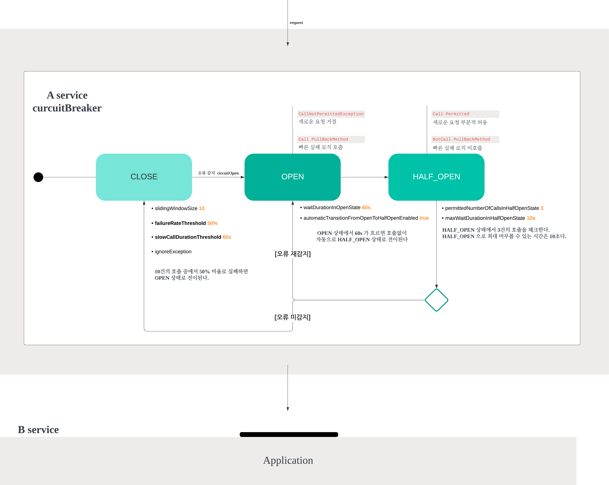

# CircuitBreaker

## 최초 실행
[FeignTestApplication.kt](src/test/kotlin/com/yoon/test/FeignTestApplication.kt) 에서 main method 실행 (최초 실행 시 docker image 다운로드 하느라 시간이좀 걸릴수 있음)
```shell
./gradlew bootTestRun
```

## 실습 방법
[test.http](test.http) 에서 실습 해보기

```http request
### error 500
GET localhost:8080/scucess-or-error?code=500
```


5번 호출 하고 난뒤

```http request
### success 200
GET localhost:8080/scucess-or-error?code=200
```
5번을 호출 하면 Circuit이 OPEN을 확인 가능

```http request
### circuitBreakers 상태 확인
GET localhost:8080/actuator/circuitbreakers
```

```http request
### circuitBreakers 이벤트 이력 확인
GET localhost:8080/actuator/circuitbreakerevents
```

### circuitBreaker transition status

OPEN 된 후 10초를 기다리면 HALF_OPEN이 됨 HALF_OPEN 상태에서 아래 테스트를 진행 하면 2가지 상태로 전이 할 수 있음
* 10초 후 HALF_OPEN 상태에서 500을 4번 이하 호출 후 200을 호출하면 CLOSED
* 10초 후 HALF_OPEN 상태에서 500을 5번 이상 호출 후 200을 호출하면 OPEN


### dependencies
add dependencies for circuitBreaker test
- Spring cloud with FeignClient , circuitBreaker, resilience4j
- MockServer with netty and okhttp, testcontainers
- actuator, (option) micrometer's prometheus
